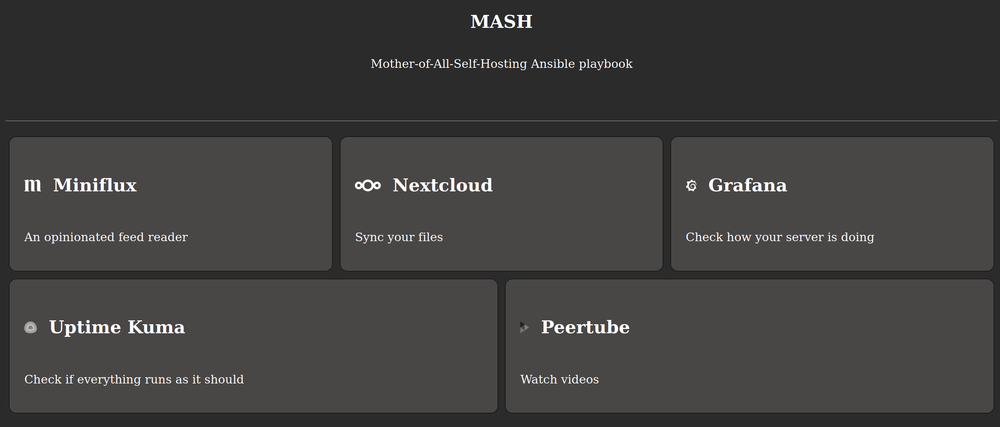

# Hubsite

Hubsite is an ansible role to run a simple, static site that shows an overview of available services.

It is powered by the official nginx docker image.


## How does it look?



It uses `prefers-color-scheme` to automatically set the color scheme to light or dark.

## Configuration

You can use the following variables to control your hubsite:

```yaml
hubsite_enabled: true
hubsite_hostname: "example.com"
hubsite_title: "My services"
hubsite_subtitle: "Just click on a service to use it"

# Use `hubsite_service_list_auto` if you develop a playbook. A user can then add additional services via `hubsite_service_list_additional`

# Nextcloud
hubsite_service_nextcloud_enabled: "{{ nextcloud_enabled }}"
hubsite_service_nextcloud_name: Nextcloud
hubsite_service_nextcloud_url: "'https://{{ nextcloud_hostname }}{{ nextcloud_path_prefix }}"
hubsite_service_nextcloud_logo_location: "{{ role_path }}/assets/nextcloud.png"
hubsite_service_nextcloud_description: "Sync your files & much more"
hubsite_service_nextcloud_priority: 1000

# Peertube
hubsite_service_peertube_enabled: "{{ peertube_enabled }}"
hubsite_service_peertube_name: Peertube
hubsite_service_peertube_url: "'https://{{ peertube_hostname }}{{ peertube_path_prefix }}"
hubsite_service_peertube_logo_location: "{{ role_path }}/assets/peertube.png"
hubsite_service_peertube_description: "Watch and upload videos"
hubsite_service_peertube_priority: 1000

hubsite_service_list_auto: |
  {{
    ([{'name': hubsite_service_nextcloud_name, 'url': hubsite_service_nextcloud_url, 'logo_location': hubsite_service_nextcloud_logo_location, 'description': hubsite_service_nextcloud_description, 'priority': hubsite_service_nextcloud_priority}] if hubsite_service_nextcloud_enabled else [])
    +
    ([{'name': hubsite_service_peertube_name, 'url': hubsite_service_peertube_url, 'logo_location': hubsite_service_peertube_logo_location, 'description': hubsite_service_peertube_description, 'priority': hubsite_service_peertube_priority}] if hubsite_service_peertube_enabled else [])
  }}

```

If you don't have a fitting logo for your service just use `logo_location': ''`


## Logos

There are some logos provided, so you can get started with a nice look immediately.

| Service     | Licence                                                                           | Author                | Changes made | Use it with                              |
|-------------|-----------------------------------------------------------------------------------|-----------------------|--------------|------------------------------------------|
| Uptime Kuma | [MIT](https://github.com/louislam/uptime-kuma/blob/master/LICENSE)                | Louis Lam             | ✅            | `{{ role_path }}/assets/uptime-kuma.png` |
| Gitea       | CC BY-SA 4.0                                                                      | Lauris BH             | ✅            | `{{ role_path }}/assets/gitea.png`       |
| GoToSocial  | [AGPL v3.0](https://github.com/superseriousbusiness/gotosocial/blob/main/LICENSE) | GoToSocial Authors    | ✅            | `{{ role_path }}/assets/gotosocial.png`  |
| Grafana     | [AGPL v3.0](https://github.com/grafana/grafana/blob/main/LICENSE)                 | Grafana Labs          | ✅            | `{{ role_path }}/assets/grafana.png`     |
| Miniflux    | [CC-BY 4.0](https://creativecommons.org/licenses/by/4.0/)                         | Frédéric Guillot      | ✅            | `{{ role_path }}/assets/miniflux.png`    |
| Peertube    | Public Domain                                                                     | PeerTube contributors | ✅            | `{{ role_path }}/assets/peertube.png`    |
| Nextcloud   | Public Domain                                                                     | Nextcloud             | ✅            | `{{ role_path }}/assets/nextcloud.png`   |
| Vaultwarden | [AGPL v3.0](https://github.com/dani-garcia/vaultwarden/blob/main/LICENSE.txt)     | Mathijs van Veluw     | ✅            | `{{ role_path }}/assets/vaultwarden.png` |